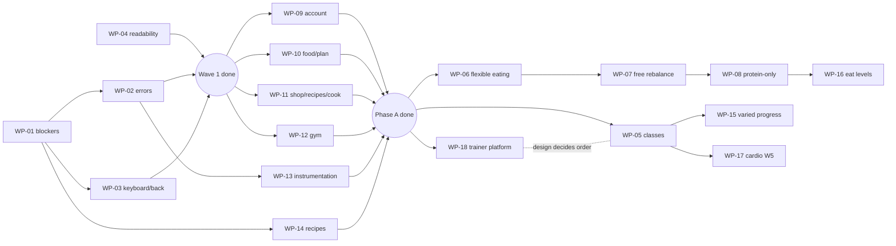

# Chefer work backlog — October 2026

_Written 2026-10-02. Owner decisions signed off the same day (see [OWNER-ACTIONS.md](./OWNER-ACTIONS.md#product-decisions-signed-off-by-the-owner-2026-10-02))._

**Sources.** Every item from these is either scheduled or explicitly not:

1. **The mobile UX audit**: [`../mobile-ux-audit-2026-10/README.md`](../mobile-ux-audit-2026-10/README.md). It has 172
   findings: 2 S0, 28 S1, 98 S2, 44 S3. **All 172 IDs are assigned below.**
2. **The user-needs research**: `docs/product/user-needs-research-2026-10.md` and `docs/product/nice-to-have.md`.
3. **Tester feedback from 2026-10-02**: [feedback-2026-10-02.md](./feedback-2026-10-02.md). It contains one class-goer's
   interview and two improvements: text is too small, and freestyle swap asks an unneeded question.

**Owner direction (2026-10-02):**

- consolidate first: fixes, polish and beta readiness (**Phase A**);
- then new features (**Phase B**), led by the **trainer platform** (WP-18).

## How to use this

- **Autonomous:** paste [DRIVER-PROMPT.md](./DRIVER-PROMPT.md) into a fresh Opus 5.5 session.
  - It works through Phase A package by package, stacking PRs instead of waiting for merges.
  - It then designs the trainer platform and stops.
- **Manual:** paste one package's **Kickoff prompt** (at the end of each WP file) into a fresh Opus 5.5 session.
- **Either way,** sessions follow [00-operating-rules.md](./00-operating-rules.md):
  - their own worktree, DB clone and ports, with mock AI;
  - Sonnet 5.5 lane agents, at most 3 at a time;
  - a test per fix and the full ladder;
  - the iOS simulator plus **one** Android emulator;
  - one PR per package, which **you** merge. Merging deploys and publishes an OTA update.
- **Live state** is the coordination file `/Users/danpop/work/git-projects/chefer-backlog-status.md`, outside the repo.
  It holds the status board, the emulator lock, API-level claims and a log.
- **Your items** are in [OWNER-ACTIONS.md](./OWNER-ACTIONS.md): the ops tasks, the native tester-build batch, and the
  decisions.

## Phase A: fix and consolidate

| Order | WP                                                   | Title                                                | Size | Covers                                                                                                                                               | Depends on               |
| ----- | ---------------------------------------------------- | ---------------------------------------------------- | ---- | ---------------------------------------------------------------------------------------------------------------------------------------------------- | ------------------------ |
| 1     | [WP-01](./WP-01-beta-blockers.md)                    | Beta blockers (the owner's must-fix prompt, refined) | XL   | ACC-01, 02, 03, 12, 17; ONB-01, 08; FOOD-01, 02, 03, 06, 07, 17; PLAN-01, 02, 03, 06, 09; REC-01, 02; GYM-01, 02, 03, 05, 06, 07; X-01, 02, 06 (gym) | —                        |
| 1     | [WP-04](./WP-04-readability-and-freestyle-swap.md)   | Readability + freestyle swap                         | M–L  | **Feedback 1 + 2**; X-08, 09, 10, 14; FOOD-24; ACC-27; PLAN-13                                                                                       | — (runs alongside WP-01) |
| 2     | [WP-02](./WP-02-s1-leftovers-and-silent-failures.md) | S1 leftovers + silent failures (§6.3, §6.8)          | L    | FOOD-04, 05, 09; GYM-04, 08, 11, 21–25; PLAN-14; SHOP-02 (errors); ONB-09; ACC-10, 20; X-06, 12, 13; REC-03; COOK-03; and WP-01's deferrals          | WP-01                    |
| 3     | [WP-03](./WP-03-keyboard-and-back-navigation.md)     | Keyboard + back navigation, JS-only (§6.1, §6.2)     | L    | X-03, 04, 05, 11, 16, 17; FOOD-08, 10, 16; ONB-03, 06, 07; PLAN-10; ACC-05, 25, 26; GYM-26, 35; REC-06; COOK-02                                      | WP-01                    |
| 4     | [WP-09](./WP-09-account-onboarding-polish.md)        | Account + onboarding polish                          | M–L  | ACC-04, 06, 07, 08, 09, 11, 13–16, 18, 19, 21–24; ONB-04, 05, 10                                                                                     | Wave 1                   |
| 5     | [WP-10](./WP-10-food-plan-polish.md)                 | Food + plan polish                                   | L    | FOOD-11–15, 18–23, 25–28; PLAN-04, 05, 07, 11, 12, 15                                                                                                | Wave 1                   |
| 6     | [WP-11](./WP-11-shop-recipes-cook-units.md)          | Shop, recipes, cook, units (§6.4)                    | L    | SHOP-01–07; REC-04, 05, 07–15; COOK-01, 04, 05; GYM-17, 19; X-15                                                                                     | Wave 1                   |
| 7     | [WP-12](./WP-12-gym-polish.md)                       | Gym polish                                           | M–L  | GYM-09, 10, 12–16, 18, 20, 27–34                                                                                                                     | Wave 1                   |
| 8     | [WP-13](./WP-13-beta-instrumentation.md)             | Beta instrumentation + re-engagement                 | M    | PO-02 (events + SQL), PO-05, PO-08, PO-10                                                                                                            | WP-02; OA-2 (key)        |
| 9     | [WP-14](./WP-14-recipe-variety.md)                   | Recipe variety + Romanian staples                    | M    | PO-06                                                                                                                                                | WP-01                    |
| —     | [OWNER](./OWNER-ACTIONS.md)                          | Owner actions, native batch, decisions               | —    | ONB-02; PO-01, 03, 04, 07, 09; X-07; native parts of X-03, GYM-10, ACC-08, PO-08; SOC-01–03 (flag off, D-6)                                          | —                        |

"Wave 1" means WP-01 to WP-04.

## Phase B: new features (after Phase A merges, in this order)

| Order | WP                                         | Title                                                 | Size | Covers                                                                                                                                                                                                                                                                                                                                                                                                                                                                             | Depends on                     |
| ----- | ------------------------------------------ | ----------------------------------------------------- | ---- | ---------------------------------------------------------------------------------------------------------------------------------------------------------------------------------------------------------------------------------------------------------------------------------------------------------------------------------------------------------------------------------------------------------------------------------------------------------------------------------- | ------------------------------ |
| 1     | [WP-18](./WP-18-trainer-platform.md)       | **Trainer coaching, 1:1** (D-7: top priority)         | XL   | Nice-to-have "Trainer platform", research G8. **Phase 0 revised 2026-10-04** for the owner's 1:1 model (trainer and client both edit the client's routine, next-session targets, private notes; no groups or classes): [spec](../trainer-platform/spec.md), [Phase 1 plan](../trainer-platform/phase-1-plan.md), [interview kit](../trainer-platform/interview-kit.md). **Phase 1** (4 lanes, ≈ 4–5 days, API level 6) after sign-off; nothing merges before the trainer interview | Phase A + sign-off + interview |
| 2     | [WP-05](./WP-05-class-goers.md)            | Class-goers: classes path, check-in, weekly burn goal | L    | **Paused 2026-10-04 (owner).** Classes are out of WP-18, and the class check-in is replaced by an **activity quick-log** idea: any user logs "45 min cycling class, 400 kcal" as a record only (no eating back calories). Needs its own small spec before it is scheduled                                                                                                                                                                                                          | Owner: spec the quick-log      |
| 3     | [WP-06](./WP-06-flexible-eating.md)        | Flexible eating                                       | M–L  | **Research Food 1 + 2**                                                                                                                                                                                                                                                                                                                                                                                                                                                            | Phase A                        |
| 4     | [WP-07](./WP-07-free-protein-rebalance.md) | Free, protein-aware rebalance                         | M    | **Research Food 3**, plus the 2 Oct re-gating (D-4); PLAN-08, 09                                                                                                                                                                                                                                                                                                                                                                                                                   | WP-06                          |
| 5     | [WP-08](./WP-08-protein-only-mode.md)      | Protein-only mode                                     | M    | **Research Food 5** (D-5)                                                                                                                                                                                                                                                                                                                                                                                                                                                          | WP-07                          |
| 6     | [WP-15](./WP-15-17-next.md)                | Progress for varied training                          | M    | **Research Gym 3**                                                                                                                                                                                                                                                                                                                                                                                                                                                                 | WP-05 + more interviews        |
| 7     | [WP-16](./WP-15-17-next.md)                | "How do you eat?" levels                              | M–L  | **Research Food 4**                                                                                                                                                                                                                                                                                                                                                                                                                                                                | WP-08 + beta data              |
| 8     | [WP-17](./WP-15-17-next.md)                | Cardio W5                                             | L    | **Research Gym 4**                                                                                                                                                                                                                                                                                                                                                                                                                                                                 | WP-05                          |

**Not scheduled:** the rest of `docs/product/nice-to-have.md`. The interview adds evidence for two of those ideas:

- curated combo exercises;
- Health Connect sync.

## How things were grouped and ordered

- **WP-01 is the P0.** Your must-fix prompt, plus the S1s on the same code paths. Two facts from the code change its plan:
  - `react-native-keyboard-controller` and `react-native-gesture-handler` aren't installed, so the fixes use RN core;
  - the "wrong week" bug sits at **six** call sites, not one.
- **The tester's feedback goes first where it's cheap.** Both improvements are in WP-04, which can run **in parallel with
  WP-01** on disjoint files.
- **Structural over one-off.** WP-02 and WP-03 build the shared primitives that close about 40 S2 findings:
  - error and query state, `ConfirmSheet` busy, notification permission;
  - keyboard inset, unsaved guard, `SearchField`, snackbar.
- **Polish is grouped by code area**, so each PR owns one file set and two can run in parallel.
- **New features wait for consolidation** (owner, 2 Oct), with the trainer platform first. The order inside Phase B keeps
  the research Summary order, with protein-only moved ahead of the "How do you eat" levels because of the interview.

## Timeline

This is a target. The driver stacks PRs, so it doesn't wait for merges. You merge in the order it reports.

| Day       | Track 1                                  | Track 2                           | Owner                                                                                                        |
| --------- | ---------------------------------------- | --------------------------------- | ------------------------------------------------------------------------------------------------------------ |
| Sat 3 Oct | **WP-01** (runs into day 2)              | **WP-04**                         | OA-1 flag, OA-4 Play account, OA-3 AI capacity, OA-9 cleanup. App Store: see OWNER-ACTIONS "App Store 1.0.0" |
| Sun 4     | WP-01 → PR                               | **WP-02** (stacked on WP-01)      | Merge WP-04, then WP-01                                                                                      |
| Mon 5     | **WP-03**                                | WP-02 → PR                        | Prepare the native batch                                                                                     |
| Tue 6     | **WP-09**                                | **WP-10**                         | Merge Wave 1. **Build the tester binary** (native batch) and run the §10 real-device pass (OA-8)             |
| Wed 7     | **WP-11**                                | **WP-12**                         |                                                                                                              |
| Thu 8     | **WP-13**                                | **WP-14**                         | OA-2 analytics key                                                                                           |
| Fri 9     | **WP-18 Phase 0** (design)               | buffer / fix-ups from your review | Sign off the WP-18 design                                                                                    |
| Next week | **Phase B**: WP-18 Phase 1, then WP-05 … |                                   |                                                                                                              |

**Estimate:** Phase A takes about 6–7 working days with two packages in flight. Each package runs about 0.5–1.5 days
by size: S ≈ 0.5, M ≈ 1, L ≈ 1–1.5, XL ≈ 1.5–2.

## Conflict map

These are the hot files and the order in which packages own them. Never run two packages that own the same zone at once.

| Zone                                                                         | Owners, in order                                                                                                |
| ---------------------------------------------------------------------------- | --------------------------------------------------------------------------------------------------------------- |
| Tracker (`app/tracker.tsx`, `tracker.service.ts`, `daily-log.repository.ts`) | WP-01 → WP-10 → WP-06 → WP-07                                                                                   |
| Rebalance (`meal-plan/rebalance.ts`), plan features                          | WP-01 (wrong week) → WP-10 → WP-07                                                                              |
| Onboarding wizard                                                            | WP-01 → WP-03 (keyboard) → WP-09 → WP-13 (opt-in) → WP-05 (training step) → WP-08 (numbers step)                |
| Gym setup + gym Today                                                        | WP-01 → WP-02 (reminders) → WP-12 → WP-18 / WP-05                                                               |
| Workout logger (`features/gym/workout/*`)                                    | WP-01 (`number-sheet`) ‖ WP-04 (set-row, cards, sheets) → WP-03 (log/edit modes) → WP-12                        |
| `packages/ui-mobile` primitives                                              | WP-01 (Sheet) ‖ WP-04 (Text, Button, chips) → WP-02 (ConfirmSheet, hooks) → WP-03 (scroll, search, snackbar)    |
| `tailwind.config.js`                                                         | WP-04 only                                                                                                      |
| Prisma schema                                                                | WP-11 (`deleteMine`) in Phase A; WP-18, WP-05, WP-06 (maybe), WP-08 in Phase B. Sequential, additive migrations |
| API level number                                                             | Claimed in the live coordination file before coding                                                             |

## Status snapshot

The live status is in `/Users/danpop/work/git-projects/chefer-backlog-status.md`. This table is only a snapshot at
merge time: none of the packages had started when this was committed.
