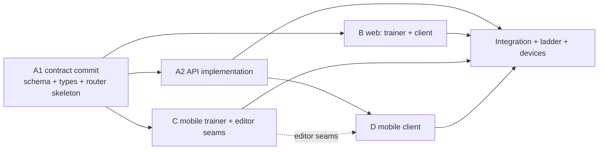

# Trainer coaching: Phase 1 build plan (WP-18)

_Written 2026-10-04 with the revised [spec.md](./spec.md). For the Phase 1 orchestrator (Opus) and its Sonnet lane
agents. Read [`docs/backlog-2026-10/00-operating-rules.md`](../backlog-2026-10/00-operating-rules.md) first; it
overrides habits, and `CLAUDE.md` overrides both. **Starts only after the owner signs off spec §14.** Nothing merges
to master before the trainer interview notes are committed (spec §12)._

Spec references below are `spec §N`. Give lane agents **absolute paths and line ranges**, never "read the whole spec".

## 0. Setup (orchestrator)

| Item               | Value                                                                                                                                                                                                                                                             |
| ------------------ | ----------------------------------------------------------------------------------------------------------------------------------------------------------------------------------------------------------------------------------------------------------------- |
| Integration branch | `feat/trainer-coaching` in `/Users/danpop/work/git-projects/chefer-wp18` (merge `origin/master` in first)                                                                                                                                                         |
| Lane worktrees     | `../chefer-wp18-a`, `-b`, `-c`, `-d`; branches `feat/trainer-coaching-a` … `-d`, cut from the integration branch                                                                                                                                                  |
| DB                 | `chefer_wp18` (clone of `chefer_dev`, operating rules §2.4); lanes share it; migrations only against this clone                                                                                                                                                   |
| Ports              | API 3218, web 3318, Metro 8118 (`wp18-api`, `wp18-web`, `wp18-metro` in the worktree-local `.claude/launch.json`)                                                                                                                                                 |
| Flags / env        | `FEATURE_FLAGS=coaching` (or `COACHING_ALLOWLIST`), `TRAINER_ALLOWLIST=*` in the worktree `.env` only                                                                                                                                                             |
| API level          | **Before lane A starts:** claim level 6 in `/Users/danpop/work/git-projects/chefer-backlog-status.md` "Locks and claims" (For: "WP-18 coaching"), and note "INTERVALS moves 5 → 7" (spec §10). If 6 is gone, take the next free and renumber `COACHING_API_LEVEL` |
| Accounts           | Throwaway `wp18-trainer@chefer.dev`, `wp18-client1@…`, `wp18-client2@…` in the clone                                                                                                                                                                              |

**Lane order (max 3 lanes at once):**

1. **Lane A alone** until its **A1 contract commit** (about half a day): migration, `@chefer/types` coaching
   schemas/DTOs/copy, `COACHING_API_LEVEL`, the flag key, and `trainer.*` / `coaching.*` routers whose procedures
   have their final inputs and outputs (implemented or throwing `NOT_IMPLEMENTED`). The orchestrator merges A1 into
   the integration branch.
2. **A2 + B + C** in parallel (3 lanes). B and C build against A1's `AppRouter` types with mocked tRPC in unit tests,
   then run against the real API once A2 lands.
3. **D** starts when A2 is merged (a slot frees up), and after C's editor-seam commit if it needs it (D doesn't edit
   those files).
4. Integration, the full ladder (operating rules §5) and device checks.

| Lane                             | Size            | Elapsed slot |
| -------------------------------- | --------------- | ------------ |
| A                                | L, ≈ 2 days     | days 1–2     |
| B                                | L, ≈ 1.5–2 days | days 1.5–3.5 |
| C                                | M–L, ≈ 1.5 days | days 1.5–3   |
| D                                | M, ≈ 1 day      | days 2.5–3.5 |
| Integration, ladder, devices, PR | ≈ 1 day         | days 3.5–4.5 |

**Why client web sits in lane B (not with client mobile):** the client's web surfaces (routine stamps, trainer notes,
join page) edit the same `apps/web/src/features/gym/routine/components/*` files the trainer web editor needs. One owner
per file keeps merges trivial. Likewise lane C owns the shared mobile routine-editor files, including the client-side
display of stamps and notes in the routine editor.

## 1. Global acceptance criteria (the PR)

1. Trainer (web **and** mobile) turns on tools, creates an invite, and client 1 joins on mobile through the link and
   the consent screen; client 2 joins on web.
2. The trainer edits client 1's routine (swap an exercise, change sets × reps, add a trainer note) and saves. Client 1's
   mobile routine shows "Ana changed your routine · <date>", "Changed by Ana" on exactly the changed rows, and the note
   in the workout logger. Rows the trainer didn't change show nothing.
3. The trainer sets a next-session target (62.5 kg × 6 × 4) on client 1's squat. Client 1's next workout prescribes it
   with "Set by Ana". After the session syncs, the target is consumed, the engine continues from the logged sets, and
   the trainer sees "Used <date>".
4. Client 1 edits a row; the trainer sees "Changed by Maria". Both edit the routine at once: the second save gets the
   conflict dialog naming the other person on both platforms; "Keep mine" and "Use the other version" both work.
5. The trainer sees client 1's completed workouts (sets, weights, reps, last-set effort, dates) and adherence (8 weeks,
   14-day strip, a pause shown without its reason). No food, weight, targets, notes, heart rate or calorie estimates
   appear in any `trainer.*` response (asserted on the JSON).
6. The trainer's private note saves and reloads; it appears in no client response, no log line and no analytics event.
7. Client 1 leaves: the trainer gets `NOT_FOUND` on the next request and the client disappears from the list; client 1
   keeps the routine, trainer notes and any pending target, and can clear notes. A `COACHING_SHARING` grant and
   withdrawal are in the consent log with `contextId`.
8. Joining a second trainer switches (old link ended, withdrawal event). The partial unique index rejects two ACTIVE
   links for one client under a race (repository test).
9. A level-4 client (contract test) sees no new fields, no `COACHING_SHARING` rows, and still gets the trainer's target
   applied. A level-4 full-document routine save keeps `trainerNote` on kept rows.
10. Flag off and not allowlisted: every `trainer.*` / `coaching.*` call is `NOT_FOUND`, and no entry point renders.
11. Ladder levels 0–6 pass; `bundle:check` passes and the runtime fingerprint is unchanged (no native change).

## 2. Lane A: schema, types, utils, API, compatibility, docs

**Size:** L (≈ 2 days). **Model:** Sonnet. **Commit A1 first** (contract), then A2.

**Owns:**

- `packages/database/prisma/schema.prisma` (spec §5.1–5.2) and one new migration folder
  `packages/database/prisma/migrations/<timestamp>_trainer_coaching/` (incl. the raw-SQL partial unique index)
- `packages/database/src/repositories/{trainer-profile,coaching-invite,coaching-link,coaching-note}.repository.ts` (+
  interfaces, + exports in the package index), `routine.repository.ts` (`replaceDocument` gains an optional
  `{ actorId, path: 'OWNER' | 'TRAINER', clearTrainerNoteIds? }` argument; stamps + `trainerNote` rules, spec §5.3),
  `consent-event.repository.ts` (`contextId`)
- `packages/types/src/coaching/{schemas,dto,copy,limits,index}.ts`; `packages/types/src/gym/{engine,dto,schemas}.ts`
  (additive optional fields, `clearTrainerNoteIds`); `packages/types/src/feature-flags.ts` (`coaching`);
  `COACHING_API_LEVEL = 6`
- `packages/utils/src/gym/routine-diff.ts` (`diffRoutineDoc`), `packages/utils/src/coaching/adherence.ts`
  (`buildAdherence`), `packages/utils/src/gym/reasons.ts` (USER_OVERRIDE copy takes an optional setter name), with
  co-located tests
- `apps/api/src/application/coaching/**` (`trainer-profile`, `coaching-invite`, `coaching-link`, `coaching-access`,
  `coaching-content`, `trainer-routine`, `coaching-note` services, `coaching-dto.mappers.ts`, tests)
- `apps/api/src/lib/coaching-middleware.ts` (`coachingProcedure`, `trainerProcedure`, `requireCoachingAccess`)
- `apps/api/src/routers/trainer/**`, `apps/api/src/routers/coaching.router.ts`, `apps/api/src/routers/index.ts`
  (register only)
- Additive edits: `apps/api/src/application/gym/{routine.service,progression.service,mappers,gym-bootstrap.service,client-level}.ts`
  (actor + stamps, `setById`, level-6 stripping, INTERVALS gate 5 → 7), `apps/api/src/routers/gym/{routine,progression,index}.router.ts`
  (pass actor/level), `apps/api/src/application/privacy/privacy.service.ts` + `routers/privacy.router.ts` (filter below
  level 6), `apps/api/src/application/user/account-data.service.ts` (export section)
- `apps/api/src/workers/coaching-maintenance.worker.ts` (+ registration in `apps/api/src/index.ts`): prune invites 30
  days after expiry, notes hidden > 30 days, ended links > 24 months
- `apps/api/src/lib/env.ts`, `apps/api/.env.example` (`COACHING_ALLOWLIST`, `TRAINER_ALLOWLIST`)
- `apps/mobile/tests/contract/{trainer,coaching,coaching-compat}.contract.test.ts`, and an optional `apiLevel` override
  in `apps/mobile/tests/contract/client.ts` (the client otherwise sends the app's real header)
- Docs: `infrastructure.md` §6, §7, §8, §9 (level table: 6 = coaching, INTERVALS → 7), §10; `business_flow.md`
  (coaching flows); `docs/trainer-platform/dpia-addendum.md` (spec §8.4 outline; the orchestrator may take this)

**Read-only pointers:** spec §5–§10; `apps/api/src/application/friends/{social-access,friend-content}.service.ts`
(pattern); `apps/api/src/lib/friends-middleware.ts:90-125`; `routine.repository.ts:172-270`;
`progression.service.ts:48-140, 220-250`; `packages/utils/src/gym/progression.ts:964-1010`; `client-level.ts`.

**Tasks (one line each):**

1. Schema + migration (spec §5), Prisma generate, migrate against `chefer_wp18`.
2. Zod schemas, DTOs, `COACHING_COPY` (consent screen, Your trainer, stamps, errors), `COACHING_LIMITS` (open
   invites 20, clients 50, invite TTL 14 days, note 4000, trainer note 200, workout window 28 days).
3. Router skeleton with final signatures → **commit A1** ("feat(api): trainer coaching contracts").
4. `diffRoutineDoc` + stamping inside `replaceDocument`'s transaction; `trainerNote` never written on the OWNER path
   except `clearTrainerNoteIds`; `notes` never written on the TRAINER path.
5. Access service (spec §8.1) + middleware; invite/join/leave/remove/deactivate with consent events in the same
   transaction.
6. Content service: workouts (exclusions in spec §7.2), exercise history, adherence, routine with `next` per row.
7. Trainer routine writes: save (curated-only rule), create when none active, next targets via
   `ProgressionService.setOverride(…, { setById })`.
8. Level-6 stripping in gym mappers and consent history; INTERVALS gate to 7 (update its test and comments).
9. Export section, maintenance worker, env vars, rate limits (`previewInvite` 30/h, `join` 10/h, `invites.create`
   50/day).
10. Docs (infrastructure, business flow, DPIA addendum draft).

**Tests:**

- Unit (Vitest, mocked repositories): access matrix (no link / ended / active / self / flag off / trainer off ×
  every `trainer.client.*`); join edge cases (expired, used, revoked, self, switch, already yours); `diffRoutineDoc`
  (new, changed, unchanged, reorder only, superset renormalisation, deleted rows); stamping for both actors;
  `trainerNote` preserved on an owner save without the field; `clearTrainerNoteIds`; `setById` on overrides from both
  procedures; workout DTO exclusions (snapshot the keys); level-6 stripping; consent-history filtering; export; worker
  pruning; INTERVALS at 7.
- Repository test against the clone: two concurrent joins for one client → one ACTIVE link.
- Contract (`pnpm mobile:contract` against `wp18-api`): `trainer.contract.test.ts` (activate → invite → join with a
  second user → routine read/save/conflict → setNextTarget → client bootstrap at level 6 shows note, stamps, setBy →
  leave → trainer `NOT_FOUND`), `coaching.contract.test.ts` (preview states, switch), `coaching-compat.contract.test.ts`
  (level 4: no new keys, no `COACHING_SHARING`, override still applied, old save keeps `trainerNote`).
- API without a DB (ladder level 2) still passes.

**Commands before reporting:** `pnpm --filter @chefer/database db:generate`, `pnpm typecheck`, `pnpm lint`,
`pnpm --filter @chefer/api test`, `pnpm --filter @chefer/utils test`, `pnpm --filter @chefer/types test`,
`cd apps/api && DATABASE_URL=postgresql://nobody:x@127.0.0.1:1/none npx vitest run`, `pnpm mobile:contract` (API on
3218).

## 3. Lane B: web (trainer area + client surfaces)

**Size:** L (≈ 1.5–2 days).

**Owns:**

- `apps/web/src/app/(dashboard)/trainer/**`: `layout.tsx` (`metadata.title` "Clients"), `page.tsx` (client list +
  invites), `[clientId]/page.tsx` (Workouts / Adherence tabs + private-notes panel), `[clientId]/routine/page.tsx`
  (editor + next-session panel); `apps/web/src/features/trainer/**`
- `apps/web/src/app/(dashboard)/coaching/join/[code]/page.tsx` (+ `layout.tsx`), `apps/web/src/features/coaching/**`
  (consent screen from `COACHING_COPY`, Your trainer card, open-in-app button)
- Profile entries: "Trainer tools" and "Your trainer" in `apps/web/src/app/(dashboard)/profile/**`; a "Clients" nav
  item for active trainers in `apps/web/src/features/nav/**`
- Shared editor seams (additive props, owner mode unchanged): `apps/web/src/features/gym/routine/components/{DayCard,ExerciseFieldsForm,DesktopEditorBoard,PhoneEditorList,ExercisePickerSheet,OverrideTargetSheet,ConflictDialog}.tsx`,
  `apps/web/src/features/gym/routine/{draft,conflict}.ts`
- Client display: `apps/web/src/app/(dashboard)/gym/routine/**` (stamps, trainer notes, remove-note →
  `clearTrainerNoteIds`), `apps/web/src/features/gym/workout/**` (trainer note line, "Set by Ana"),
  `apps/web/src/features/gym/today/**` (one-line notice)
- `apps/web/src/lib/{trpc-provider.tsx,trpc-server.ts}`: header `'6'` (web is always latest)
- `tests/e2e/trainer.spec.ts`, `tests/e2e/coaching-join.spec.ts`; add `/trainer` and a client route to `APP_ROUTES` in
  `tests/e2e/helpers/layout.ts`

**Rules that bite here:** every page in `<main id="main">` with one `<h1>`; overlays through `Sheet`/`Drawer`;
`min-w-0` on text flex children; 44 px targets; no `h-screen`; inputs labelled (`Note for Maria` is a real label);
press feedback via `pressControl`/`pressCard`; motion IDs from `docs/audit-2026-09/motion-system.md` in comments.
Desktop-first for `/trainer` means: design at `lg`/`xl` first (table + side panel), then make it work down to 320 px.

**Acceptance:** global criteria 1–7 and 10 on web; the trainer editor reuses the gym editor components (no forked
copies); the owner's own `/gym/routine` editor behaves exactly as before when not coached.

**Tests:** Vitest/RTL for the consent screen (renders every `COACHING_COPY` line), the trainer note field (label,
200-char limit, error linked with `aria-describedby`), the attribution badge, the conflict dialog copy with a name,
the next-session panel states (suggestion / set by you / set by client / used). Playwright `trainer.spec.ts`
(desktop): activate → invite → second browser context registers and joins → trainer edits routine and sets a target →
client sees stamps and note. `coaching-join.spec.ts`: expired / used / self invite states. Then
`cd tests && pnpm exec playwright test --project=mobile`.

**Commands:** `pnpm --filter @chefer/web typecheck`, `pnpm --filter @chefer/web lint`, `pnpm --filter @chefer/web test`,
Playwright as above against `wp18-web` + `wp18-api` (the orchestrator starts servers; the lane may run Playwright only
if the orchestrator gives it the ports).

## 4. Lane C: mobile trainer area + shared mobile routine-editor seams

**Size:** M–L (≈ 1.5 days).

**Owns:**

- `apps/mobile/app/trainer/**`: `index.tsx` (clients + invites), `invite.tsx`, `[clientId]/index.tsx` (segmented:
  Workouts / Adherence / Notes), `[clientId]/routine.tsx` (editor + next session); `apps/mobile/src/features/trainer/**`
- Shared seams (additive props): `apps/mobile/src/features/gym/routine/{day-editor,day-card-view,reducer,mapping,types,override-sheet,conflict}.tsx|ts`,
  `apps/mobile/src/features/gym/library/exercise-picker.tsx` (`curatedOnly`)
- Client display in the routine editor: `apps/mobile/app/gym/routine-editor.tsx` and the Routine tab
  `apps/mobile/app/(gym)/routine.tsx` (stamps, trainer notes, remove-note → `clearTrainerNoteIds`)
- `apps/mobile/tests/unit/trainer-*.test.tsx`, `apps/mobile/tests/unit/routine-attribution.test.tsx`;
  `apps/mobile/e2e/trainer-edit.flow.yaml`

**Rules:** OTA-only (no new packages; `Share` from `react-native` for invites, no clipboard module); `trainer.*`
queries stay out of the persisted cache (they are not `gym.*`, so `isGymQueryKey` already excludes them; don't
namespace them under gym); online-only editing (`useIsOnline`), like the client's editor; Android BACK closes sheets
first (WP-03 pattern); 44 pt targets; `Keyboard`/`KeyboardAvoidingView` from RN core.

**Acceptance:** global criteria 1–7 on mobile for the trainer side; the client's own routine editor is unchanged for an
uncoached user (existing Jest suites pass untouched).

**Tests:** Jest + RNTL: client list (empty, rows, inactive flag), invite share, editor with trainer-note field and
curated-only picker, next-session sheet states, conflict dialog with a name, client-side stamps/notes rendering and
remove-note. Maestro flow (local only, the orchestrator runs it): trainer opens a client and saves a change.

**Commands:** `pnpm --filter @chefer/mobile typecheck`, `pnpm --filter @chefer/mobile lint`,
`pnpm --filter @chefer/mobile test`, `pnpm --filter @chefer/mobile bundle:check`.

## 5. Lane D: mobile client (join, consent, Your trainer, notices, level 6)

**Size:** M (≈ 1 day).

**Owns:**

- `apps/mobile/app/coaching/join/[code].tsx`, `apps/mobile/app/coaching/index.tsx` (Your trainer + Leave),
  `apps/mobile/src/features/coaching/**`
- Entry rows "Your trainer" and "Trainer tools" (→ `/trainer`) in `apps/mobile/app/(food)/more.tsx` and
  `apps/mobile/src/features/settings/settings-screen.tsx` (mirror the Following rows there)
- `apps/mobile/src/features/gym/today/**` (one-line "Ana updated your routine" with a device-local seen marker; key in
  `apps/mobile/src/features/gym/offline/keys.ts`)
- `apps/mobile/src/features/gym/workout/{exercise-card,target-fields}.tsx` (trainer note line, "Set by Ana")
- `apps/mobile/src/features/privacy/consent-history.tsx` (`COACHING_SHARING` label from `COACHING_COPY`)
- `apps/mobile/src/lib/trpc-links.ts` (header `'6'`) and `GYM_CACHE_SCHEMA_VERSION` in
  `apps/mobile/src/features/gym/offline/query-persistence.ts`
- `apps/mobile/tests/unit/coaching-*.test.tsx`; `apps/mobile/e2e/coaching-join.flow.yaml`

**Rules:** the join screen handles signed-out users (sign in or register, then return to the code); `needsGymSetup`
routes to the existing setup first and comes back; every invite state from `coaching.previewInvite` has copy; the
header bump to 6 lands only with everything else at level 6 on the integration branch (the orchestrator checks this
before the PR).

**Acceptance:** global criteria 1, 2 (Today line and logger), 3 (copy), 7, 8 on mobile; consent history shows the label.

**Tests:** Jest + RNTL: join states (ok, expired, used, revoked, self, switch, needs setup), the consent screen copy, Leave
with confirm, Today notice shown once then hidden after the routine is opened, exercise-card note and "Set by Ana",
consent-history label. Maestro (orchestrator runs it): open `chefer-dev://coaching/join/<code>` → consent → joined.

**Commands:** as lane C.

## 6. Orchestrator integration checklist

1. Merge lanes into `feat/trainer-coaching` in order A1, A2, C, B, D; resolve nothing by hand in files a lane owns —
   send it back.
2. Confirm no lane touched files outside its **Owns** list (`git diff --stat` per lane).
3. Full ladder (operating rules §5): levels 0–5, then devices: iOS simulator and the Pixel_8 emulator (claim it),
   both as trainer and as client, including the two-editor conflict and an offline session that consumes a target.
4. Evidence for every global criterion (DB rows, API log lines, screenshots) in the PR body.
5. Docs: infrastructure.md §4 (new pages: web `/trainer/**`, `/coaching/join/[code]`; mobile `trainer/**`,
   `coaching/**`), §6–§10, §12–13 unchanged; `business_flow.md`; spec §2 adjusted after the interview;
   `mobile_parity_backlog.md` needs no entry (both platforms ship).
6. Owner actions (OWNER-ACTIONS.md): privacy policy "Coaching" section + `LEGAL_VERSIONS.privacy` bump; trainer
   clause in the terms; production env `COACHING_ALLOWLIST`, `TRAINER_ALLOWLIST`; keep `coaching` off.
7. Update the coordination file (level 6 used, INTERVALS → 7, PR link) and stop servers/emulators; list `chefer_wp18`
   for dropping after merge.
