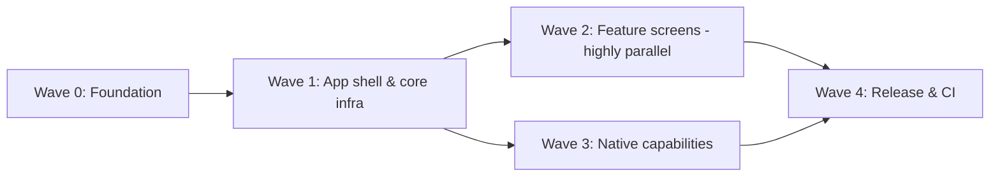

# Chefer — Native Mobile Apps Plan (iOS + Android, React Native)

> **Audience:** Claude Code instances and subagents executing this plan. Written to be
> followed task-by-task without needing the original conversation.
> **Created:** 2026-08-30, against `integrate/wave-2` @ `177cb73`.
> **Related docs:** [`infrastructure.md`](./infrastructure.md), [`business_flow.md`](./business_flow.md),
> [`CLAUDE.md`](./CLAUDE.md) (conventions — **read it first**, especially **Platform Parity**),
> [`mobile_parity_backlog.md`](./mobile_parity_backlog.md) (web changes awaiting their mobile port),
> [`mobile_responsive_plan.md`](./mobile_responsive_plan.md)
> (the _responsive web_ workstream — different scope, do not confuse).

---

## How to read this document

Every task has an ID (`M<wave>-<n>`), and is tagged:

| Tag            | Meaning                                                                                                                                                          |
| -------------- | ---------------------------------------------------------------------------------------------------------------------------------------------------------------- |
| **[CRITICAL]** | On the critical path. Later waves block on it. Do these first, sequentially if needed.                                                                           |
| **[PARALLEL]** | Independent of its siblings — multiple agents can take sibling `[PARALLEL]` tasks at once.                                                                       |
| **[USER]**     | Requires the human: account creation, credentials, installs needing admin, paid services, or a product decision. Agents must stop and ask — do not fake or skip. |
| **[OPTIONAL]** | Deliberately deferred. Do not do it unless explicitly asked.                                                                                                     |

Each task ends with **Verify:** — the exact commands/checks that prove the task is done.
An agent must run them before declaring the task complete. If a verify step cannot pass
in the agent's environment (e.g. simulator missing), say so explicitly; never claim green.

**Branching:** one branch per task or per small group of sibling tasks, named
`mobile/<task-id>-<slug>` (e.g. `mobile/m1-2-trpc-client`). Conventional Commits with scope
`mobile` (add `mobile` to the accepted scopes if commitlint rejects it — that itself is task M0-6).

**Documentation rule (from CLAUDE.md, mandatory):** any task that adds a package, app, route,
procedure, or env var updates `infrastructure.md` (and `business_flow.md` for flows) _in the same PR_.

---

## 0. Decision record (already made — do not relitigate)

| Decision            | Choice                                                                            | Why                                                                                                                                                                                                |
| ------------------- | --------------------------------------------------------------------------------- | -------------------------------------------------------------------------------------------------------------------------------------------------------------------------------------------------- |
| Framework           | **Expo (SDK 54+), managed workflow + expo-dev-client**                            | Best AI-autonomy story: CLI-driven everything, `expo-doctor`, works in iOS Simulator/Android emulator headlessly, OTA updates later. Bare RN adds native-project maintenance with no benefit here. |
| Location            | **`apps/mobile`** in this monorepo                                                | Reuses `@chefer/types`, `@chefer/utils`, and the `AppRouter` type from `@chefer/api` for end-to-end type safety — the whole point of the tRPC investment.                                          |
| Navigation          | **expo-router** (file-based)                                                      | Mirrors the Next.js App Router mental model already used in `apps/web`; deep links for free (Maestro E2E uses them to jump to screens).                                                            |
| Styling             | **NativeWind v4** (Tailwind syntax on RN)                                         | The team writes Tailwind; `cn()` from `@chefer/utils` (clsx + tailwind-merge) works as-is.                                                                                                         |
| Data layer          | **tRPC v11 React client + TanStack Query 5 + superjson** — same versions as web   | Identical to web; hooks knowledge transfers.                                                                                                                                                       |
| Auth for mobile     | **Session token as `Authorization: Bearer`**, stored in `expo-secure-store`       | The API middleware already parses Bearer headers (currently a stub). Reusing the existing DB `Session` model is a ~30-line API change vs. building a JWT flow.                                     |
| Component library   | **New `packages/ui-mobile`** for shared RN primitives; screens live in the app    | `packages/ui` is DOM/Tailwind-web — it cannot be imported by RN. Do NOT attempt react-native-web unification; out of scope.                                                                        |
| Unit tests          | **Jest + jest-expo + React Native Testing Library** (headless, no simulator)      | AI can run these autonomously anywhere. Vitest is not supported for RN — mobile is the one Jest island in the repo; that is accepted.                                                              |
| Contract tests      | **Vitest in Node against the real local API**, importing the mobile client config | Validates auth/serialization/procedure wiring with zero simulator involvement — the fastest AI feedback loop that touches reality.                                                                 |
| E2E                 | **Maestro** (YAML flows, CLI-run, screenshots on failure)                         | Far easier for agents than Detox: no test build wiring, deterministic CLI, artifacts on failure.                                                                                                   |
| Builds/distribution | **EAS Build + EAS Submit** (cloud)                                                | No local signing headaches; certificates managed by EAS. Requires accounts — see [USER] tasks.                                                                                                     |

---

## 1. Prerequisites — local tools **[USER]**

The human must install/provide these once. Agents: check availability with the preflight
script (task M0-7) and report what's missing rather than attempting admin installs.

### Required from day 1 (development + testing)

| Tool                                                      | Install                                                                           | Needed for          |
| --------------------------------------------------------- | --------------------------------------------------------------------------------- | ------------------- |
| Xcode (latest stable) + iOS platform                      | Mac App Store, then `xcodebuild -runFirstLaunch`                                  | iOS Simulator       |
| Xcode CLI tools                                           | `xcode-select --install`                                                          | builds              |
| Watchman                                                  | `brew install watchman`                                                           | Metro file watching |
| Android Studio + SDK + one emulator (Pixel-class, API 35) | https://developer.android.com/studio; accept licenses via `sdkmanager --licenses` | Android emulator    |
| JDK 17 (Temurin)                                          | `brew install --cask temurin@17`                                                  | Android builds      |
| Maestro CLI                                               | `curl -Ls "https://get.maestro.mobile.dev" \| bash`                               | E2E tests           |
| (already present) Node 20+, pnpm 9+, Docker               | —                                                                                 | everything else     |

Environment variables the human should have in their shell profile:
`ANDROID_HOME=$HOME/Library/Android/sdk` and `$ANDROID_HOME/platform-tools` +
`$ANDROID_HOME/emulator` on `PATH`.

### Required later (first device build / store release)

| What                                                          | When                                     | Notes                            |
| ------------------------------------------------------------- | ---------------------------------------- | -------------------------------- |
| Expo account + `eas-cli` (`pnpm add -g eas-cli`, `eas login`) | Wave 4                                   | Free tier is fine to start       |
| Apple Developer Program ($99/yr)                              | Wave 4 (TestFlight)                      | Human must enroll; agents cannot |
| Google Play Console ($25 one-time)                            | Wave 4                                   | Same                             |
| App icons / splash / display name decision                    | Wave 1 (placeholder ok) → Wave 4 (final) | Product decision                 |

### What agents in this environment can drive autonomously

- **iOS Simulator:** this Claude Code environment has an iOS Simulator MCP tool
  (`attach`, `launch`, `screenshot`, `tap`, `swipe`, `text`). Use it to visually verify
  screens and share screenshots. Prefer Maestro for scripted flows; use the MCP tool for
  exploratory checks and for showing the user results.
- **Android emulator:** headless via `emulator -avd <name> -no-window -no-audio` + Maestro.
- **Everything below E2E** (typecheck, lint, Jest, contract tests) needs no device at all.

---

## 2. Target architecture

```
chefer/
├── apps/
│   ├── api/                  # unchanged layering; small auth additions (Wave 0)
│   ├── web/                  # untouched
│   └── mobile/               # NEW — Expo app
│       ├── app/              # expo-router file-based routes
│       │   ├── (auth)/       #   login, register
│       │   ├── (tabs)/       #   dashboard, meal-plan, tracker, recipes, more
│       │   └── _layout.tsx   #   root: providers (tRPC, Query, theme, auth gate)
│       ├── src/
│       │   ├── lib/          #   trpc.ts, auth-store.ts, env.ts, api-url.ts
│       │   ├── features/     #   mirrors apps/web/src/features naming 1:1
│       │   └── components/   #   app-specific composites
│       ├── tests/
│       │   ├── unit/         #   Jest + RNTL
│       │   └── contract/     #   Vitest (node) against live local API
│       ├── e2e/              #   Maestro YAML flows (*.flow.yaml)
│       ├── assets/           #   icon, splash
│       ├── app.config.ts     #   Expo config (typed)
│       ├── metro.config.js   #   monorepo-aware (see M0-3)
│       ├── tailwind.config.js
│       └── package.json      #   name: @chefer/mobile
├── packages/
│   ├── ui-mobile/            # NEW — shared RN primitives (Button, Card, Sheet, …)
│   └── (types, utils, database, ui, config — unchanged)
```

**Layer rules (mirror of web):**

- Mobile talks to the API **only** through tRPC (+ the four sanctioned non-tRPC endpoints
  listed in §3-Wave-3). Never import `@chefer/database` in mobile.
- `@chefer/types` and `@chefer/utils` are shared with mobile and must stay platform-pure:
  **no DOM, no Node APIs** in anything mobile imports. `@chefer/ui` is web-only — mobile
  must never import it (enforce with ESLint, task M0-5).
- `AppRouter` is imported **type-only** from `@chefer/api` (same as web does).

**Auth model (after Wave 0):** login/register from a mobile client (identified by the
`x-chefer-client: mobile` request header) return `sessionToken` + `expires` in the body,
in addition to setting the (ignored) cookie. Mobile stores the token in SecureStore and
sends `Authorization: Bearer <sessionToken>` on every request. Same DB `Session` row,
same 30-day expiry, same logout semantics. Web behavior is byte-for-byte unchanged.

**Non-tRPC API surface mobile must integrate** (from `apps/api/src/index.ts`):
`POST /api/chat` (streamed chat), `POST /api/scan-meal` (photo → nutrition),
`/api/uploads` (multipart image upload), `GET /api/recipe-images/...` (SSE progress),
`GET /uploads/*` (static images), `GET /health`. All of these currently authenticate via
cookie **and** must accept the Bearer header after Wave 0 (they share `requireAuth` /
context middleware — verify each in M0-2).

---

## 3. Work breakdown

### Dependency graph (waves)



Within Wave 0, M0-1/M0-2 (API auth) are independent of M0-3/M0-4 (scaffold) — **two agents
can run these pairs in parallel.** Wave 2 is the big fan-out: each feature task is
independent once Wave 1 lands.

---

### Wave 0 — Foundation **[CRITICAL]**

#### M0-1 · API: real Bearer-token authentication **[CRITICAL]** — ✅ DONE 2026-08-30 (`mobile/wave-0`; also refactored the 4 Express routers' inlined cookie auth onto shared `lib/session-auth.ts`, so chat/scan/uploads/SSE accept Bearer too)

The stub is in `apps/api/src/interfaces/http/middleware/auth.middleware.ts` (~line 100):
the extracted bearer token is currently discarded (`void bearerToken; // placeholder`).

- In `createContext` (and `requireAuth`): when no valid cookie session, resolve the bearer
  token **as a session token** via the existing `resolveUserFromSession()`. Set
  `activeSessionToken` from it too (so `auth.logout` deletes the right row for mobile).
- Do NOT implement JWT. The bearer value _is_ a `Session.sessionToken`.
- Add unit tests in the API's existing Vitest suite: bearer resolves user; expired session
  → null; cookie takes precedence when both present; logout via bearer deletes the session.
- Update `infrastructure.md` §9.

**Verify:** `pnpm --filter @chefer/api test` green; manual proof:

```bash
# with pnpm dev running and DB seeded
TOKEN=$(curl -s http://localhost:3001/trpc/auth.login -X POST -H 'content-type: application/json' -H 'x-chefer-client: mobile' -d '{"json":{"email":"alice@chefer.dev","password":"User@123!"}}' | jq -r '.result.data.json.session.token')
curl -s http://localhost:3001/trpc/auth.me -H "Authorization: Bearer $TOKEN" | jq
```

(The first command depends on M0-2; until then, lift a token from the `Session` table.)

#### M0-2 · API: return session token to mobile clients **[CRITICAL]** — ✅ DONE 2026-08-30 (`mobile/wave-0`; response type is `AuthResult` in `@chefer/types`, curl-verified end-to-end incl. logout-via-Bearer)

In `apps/api/src/application/auth/auth.service.ts`, `register()` and `login()` set the
cookie and return `UserProfile` only. Change:

- When the request carries header `x-chefer-client: mobile` (plumb a flag through
  context — do not read headers in the service), the response additionally includes
  `session: { token: string; expires: Date }`. Without the header, response is unchanged
  (web must not receive the token in the body).
- `x-chefer-client` must be added to the CORS `allowedHeaders` list in `apps/api/src/index.ts`.
- Type the new response shape in `@chefer/types` (extend, don't break, `UserProfile` consumers).
- Unit tests: token present with header, absent without; token round-trips through M0-1's
  bearer path.
- Update `infrastructure.md` §8 (procedure map) and §9; `business_flow.md` §4 (auth flow).

**Verify:** `pnpm --filter @chefer/api test && pnpm typecheck` green; the two-curl proof in
M0-1 now works end-to-end.

#### M0-3 · Scaffold `apps/mobile` (Expo) **[CRITICAL]** — ✅ DONE 2026-08-30 (`mobile/wave-0`; Expo SDK 57/RN 0.86, expo-router, expo-doctor 21/21, Metro resolves workspace pkgs with NO .npmrc hack; TS pinned ^5.5.2 via root pnpm override, excluded from expo-install validation)

- `pnpm create expo-app@latest apps/mobile --template blank-typescript`, then rename the
  package to `@chefer/mobile`, align TS config to `@chefer/tsconfig` (strict), add
  expo-router, expo-dev-client, expo-secure-store, NativeWind v4 + tailwindcss 3,
  `@trpc/client @trpc/react-query @tanstack/react-query superjson` **pinned to the exact
  versions `apps/web` uses** (read them from `apps/web/package.json`).
- Monorepo Metro config (`metro.config.js`) — the known-good pnpm shape:
  ```js
  const { getDefaultConfig } = require('expo/metro-config');
  const path = require('path');
  const projectRoot = __dirname;
  const workspaceRoot = path.resolve(projectRoot, '../..');
  const config = getDefaultConfig(projectRoot);
  config.watchFolders = [workspaceRoot];
  config.resolver.nodeModulesPaths = [
    path.resolve(projectRoot, 'node_modules'),
    path.resolve(workspaceRoot, 'node_modules'),
  ];
  module.exports = config;
  ```
- `app.config.ts`: name/slug `chefer`, scheme `chefer` (deep links), `newArchEnabled: true`,
  iOS bundle id + Android package `dev.chefer.app` (placeholder until [USER] confirms).
- Add workspace deps `@chefer/types`, `@chefer/utils` and prove they resolve through Metro
  (render a value from each on the placeholder screen).
- **Known risk:** pnpm isolated `node_modules` vs Metro symlink resolution. Expo SDK 52+
  handles it; if resolution fails, the sanctioned fallback is a root `.npmrc` with
  `node-linker=hoisted` — but that changes install layout for the whole repo, so treat it
  as last resort and flag it in the PR description if used.
- Update `infrastructure.md` §1 and §5; `pnpm-workspace.yaml` already globs `apps/*`.

**Verify:** `pnpm --filter @chefer/mobile exec expo-doctor` passes;
`pnpm --filter @chefer/mobile exec expo export --platform ios` succeeds (bundles JS without
a device — this is the headless smoke test agents should reach for);
`pnpm --filter @chefer/mobile typecheck` green.

#### M0-4 · Turborepo + root wiring **[CRITICAL]** — ✅ DONE 2026-08-30 (mobile has `start` not `dev`, so `pnpm dev` stays web+api; root scripts dev:mobile / mobile:ios / mobile:android / mobile:bundle-check; turbo inputs extended with app/\*\*)

- Mobile `package.json` scripts: `dev` (`expo start`), `ios` (`expo run:ios`), `android`
  (`expo run:android`), `typecheck`, `lint`, `test` (jest), `test:contract` (vitest run),
  `e2e` (maestro test e2e/), `bundle:check` (`expo export --platform ios`).
- Ensure `turbo.json` tasks pick mobile up (they're generic — verify `inputs` cover
  `app/**`, `e2e/**`, `app.config.ts`). `pnpm dev` at root must **not** auto-start Metro
  (persistent + interactive); add root script `pnpm dev:mobile` instead.
- Root convenience scripts: `mobile:ios`, `mobile:android`, `mobile:e2e`.

**Verify:** from repo root, `pnpm typecheck` and `pnpm lint` include `@chefer/mobile` in
turbo output; `pnpm dev` still behaves exactly as before (web+api only).

#### M0-5 · Lint/format/boundary rules for mobile — ✅ DONE 2026-08-30 (`react-native.js` config + boundary rules both directions, violation-tested)

- Extend `packages/config/eslint` with a React Native flat config (`eslint-plugin-react`,
  hooks, `eslint-plugin-react-native` if compatible with ESLint 9 — if not, skip it and
  note why).
- Boundary enforcement via `no-restricted-imports` in the mobile config: forbid
  `@chefer/ui`, `@chefer/database`, `@prisma/client`, `next`, `react-dom`.
- Mirror rule on web/packages side: forbid `react-native`, `expo*` outside
  `apps/mobile` + `packages/ui-mobile`.
- Update `infrastructure.md` §5.

**Verify:** add a temp file importing `@chefer/ui` in mobile → `pnpm --filter @chefer/mobile lint`
fails; remove it → passes.

#### M0-6 · Commitlint scope + CI lanes — ✅ DONE 2026-08-30 (scopes mobile/ui-mobile; CI job "Mobile Bundle"; lint/typecheck/test lanes cover mobile via turbo automatically)

- Add `mobile` and `ui-mobile` to allowed scopes in `commitlint.config.js` if scopes are
  enumerated.
- Extend `.github/workflows/ci.yml`: mobile typecheck + lint + Jest + `bundle:check` run on
  ubuntu-latest (no macOS needed for any of those). Do **not** add simulator E2E to CI yet
  (Wave 4 decision).
- Update `infrastructure.md` §13.

**Verify:** CI passes on the PR itself.

#### M0-7 · Preflight script for agents — ✅ DONE 2026-08-30 (`scripts/mobile-preflight.sh`, 11/11 on this machine)

Create `scripts/mobile-preflight.sh`: checks and prints PASS/FAIL for node/pnpm versions,
watchman, Xcode + at least one iOS simulator (`xcrun simctl list devices available`),
`ANDROID_HOME` + emulator presence, JDK 17, maestro on PATH, API reachable at
`http://localhost:3001/health`. Exit non-zero listing what's missing. Agents run this
**before** any simulator/E2E task and report missing items to the user instead of
improvising installs.

**Verify:** script runs on this machine and its output matches reality.

---

### Wave 1 — App shell & core infrastructure **[CRITICAL, mostly sequential]**

#### M1-1 · Env & API URL handling **[CRITICAL]** — ✅ DONE 2026-08-30 (`mobile/wave-0`; env.ts + api-url.ts, platform defaults in code, unit-tested)

- `src/lib/env.ts`: Zod-validated (per repo convention) reading `EXPO_PUBLIC_API_URL`.
  Defaults: iOS simulator `http://localhost:3001`; Android emulator `http://10.0.2.2:3001`
  (Android's alias for host loopback — a classic agent trap, encode it in code via
  `Platform.OS`, not in docs only). Physical device: LAN IP, set manually.
- `.env.example` in `apps/mobile`; update `infrastructure.md` §10.

**Verify:** unit test for URL selection per platform; `pnpm --filter @chefer/mobile test`.

#### M1-2 · tRPC client + auth storage **[CRITICAL]** — ✅ DONE 2026-08-30 (auth-store on SecureStore, trpc-links shared with contract tests, 401 → clearToken → gate)

- `src/lib/auth-store.ts`: token save/load/clear via `expo-secure-store`, in-memory cache,
  exported `getToken()` for the tRPC link.
- `src/lib/trpc.ts`: `createTRPCReact<AppRouter>` with `httpBatchLink`, superjson,
  headers callback adding `Authorization: Bearer <token>` (when present) and
  `x-chefer-client: mobile` (always). On tRPC `UNAUTHORIZED`: clear token, route to login
  (mirror of web's `makeQueryClient()` 401 handling in `apps/web/src/lib/trpc.ts`).
- Root `_layout.tsx`: QueryClientProvider + trpc.Provider + auth gate (token present →
  `(tabs)`, else `(auth)`); splash until the initial `auth.me` resolves.

**Verify:** contract tests (M1-4) are the real proof; until then,
`pnpm --filter @chefer/mobile typecheck` and a Jest test for the headers callback.

#### M1-3 · Navigation shell + theme **[CRITICAL]** — ✅ DONE 2026-08-30 (NativeWind v4.2 works on SDK 57 — needed direct dep on react-native-css-interop; 5 tabs mirror nav-items.ts; ui-mobile: Button/Card/Input/Screen/Text; Sheet deferred to first sheet-needing screen)

- expo-router groups per §2 layout. Bottom tabs mirroring the web tab bar:
  Dashboard, Meal Plan, Tracker, Recipes, More (More hosts pantry/shopping-list/
  preferences/profile — confirm against `apps/web/src/features/nav`).
- NativeWind theme tokens ported from `apps/web/tailwind.config` (colors, radii, fonts).
  Dark mode via `useColorScheme`.
- `packages/ui-mobile` bootstrapped with the first primitives: `Button`, `Card`, `Text`,
  `Screen` (safe-area wrapper), `Sheet` (use `@gorhom/bottom-sheet`). CVA variants, `cn()`
  from `@chefer/utils`. Update `infrastructure.md` §1/§5.

**Verify:** `expo export` green; RNTL smoke tests render each primitive; screenshot of the
tab shell via iOS Simulator MCP or `maestro test` hello-flow.

#### M1-4 · Contract test harness **[CRITICAL]** — ✅ DONE 2026-08-30 (7 tests green vs live API; `pnpm mobile:contract`; NOTE: register/login rate limit 10/15min per IP — budget 3 auth calls per full run)

`apps/mobile/tests/contract/` — Vitest, **Node environment**, no RN imports (the files
under test must be import-safe in Node: keep `trpc.ts` free of RN-only imports at module
top level, inject the storage/platform bits).

- `setup.ts`: assert `GET /health` responds, else fail fast with the message
  "run `pnpm dev` first" (agents: start api via `pnpm --filter @chefer/api dev` in
  background if not running; DB via docker per `infrastructure/scripts/setup.sh`).
- Tests use a **vanilla** `createTRPCClient<AppRouter>` configured with the same link
  options as the app (extract link-building into a shared, platform-free
  `src/lib/trpc-links.ts` so app and tests literally share it):
  1. register a throwaway user (unique email) with mobile header → token returned
  2. `auth.me` with Bearer → correct user
  3. a representative protected read per major router (dashboard, meal-plan, recipe,
     tracker, preferences) → parses, superjson dates hydrate as `Date`
  4. logout via Bearer → subsequent `auth.me` is UNAUTHORIZED
- Root script `pnpm mobile:contract`.

**Why this matters:** every Wave-2 feature task extends this suite before building UI.
It's the loop an agent can run in seconds, headless, against the real API.

**Verify:** `pnpm mobile:contract` green with local stack up.

#### M1-5 · Auth screens **[CRITICAL]** — ✅ DONE 2026-08-30 (login/register + gate via expo-router Stack.Protected; e2e/auth.flow.yaml is the Maestro template)

Login + register under `(auth)/`, react-hook-form + the same Zod schemas as web (lift
shared schemas into `@chefer/types` if they currently live web-side), error states, link
between the two. Success → store token → `(tabs)`.

**Verify:** RNTL tests (validation, submit calls mutation — mock tRPC); Maestro flow
`e2e/auth.flow.yaml`: launch → register a unique user → land on dashboard → logout →
login again. This flow is the E2E template all Wave-2 tasks copy.

#### M1-6 · Error reporting + logging **[PARALLEL]** — ⏸ DEFERRED pending [USER] Sentry DSN (env slot exists; @sentry/react-native not yet installed — installing it later requires a dev-client rebuild)

`@sentry/react-native` via the Expo plugin, wired only when `EXPO_PUBLIC_SENTRY_DSN` is
set **[USER: provide DSN or say skip]**. Dev logging: keep Metro console clean; add a tiny
`log()` util gated on `__DEV__`. Update `infrastructure.md` §10.

**Verify:** app boots with and without the env var; `expo export` green.

---

### Wave 2 — Feature screens **[PARALLEL — the fan-out wave]**

Each task below is independent once Wave 1 lands; assign one agent per task. Every task
follows the same contract:

1. **Read the web implementation first**: `apps/web/src/features/<feature>` is the
   source of truth for behavior, states, and which tRPC procedures to call. Do not invent
   flows; port them. Check `business_flow.md` for the intended flow.
2. **Check [`mobile_parity_backlog.md`](./mobile_parity_backlog.md)** for entries on your
   feature; port them along with the base feature and mark them `done` in the same PR.
   From the moment your feature merges, the CLAUDE.md Platform Parity rule applies to it:
   future web changes to this feature must update mobile in the same task.
3. Extend `tests/contract/` with the procedures the screen consumes (before UI work).
4. Build screens in `app/(tabs)/…` + `src/features/<feature>/` (mirror web's feature dir
   naming exactly). Reusable primitives go to `packages/ui-mobile`, not copy-paste.
5. RNTL component tests for logic-bearing components (loading/error/empty/success).
6. One Maestro flow per feature: `e2e/<feature>.flow.yaml`, using a seeded account
   (`alice@chefer.dev` / `User@123!`) and deep links (`chefer://…`) to jump straight to
   the screen.
7. Update `infrastructure.md` §4 (mobile routes table — create it in the first merged
   Wave-2 PR) and `business_flow.md` if the flow differs from web.

**Verify (identical for every M2 task):**
`pnpm --filter @chefer/mobile typecheck && pnpm --filter @chefer/mobile lint && pnpm --filter @chefer/mobile test && pnpm mobile:contract` all green, plus the feature's Maestro
flow passing on the iOS simulator (run Android too when the change is layout-heavy).

| ID    | Feature (web dir)                            | Screens / notes                                                                                                                                                                                                                                                                                                                                                                                                                                                                   | Size |
| ----- | -------------------------------------------- | --------------------------------------------------------------------------------------------------------------------------------------------------------------------------------------------------------------------------------------------------------------------------------------------------------------------------------------------------------------------------------------------------------------------------------------------------------------------------------- | ---- |
| M2-1  | `dashboard`                                  | ✅ DONE 2026-08-31: week outlook + day panel, nutrition summary (3-state status), hero meal, later-today, favourites, profile nudge. Deviations: calorie ring→bar; weight/coach cards deferred to M2-9/M2-10 (need an RN chart lib). Gotcha: testID must sit on Text/Pressable, not a bare View, for Maestro to see it on iOS                                                                                                                                                     | M    |
| M2-2  | `meal-plan`                                  | ✅ DONE 2026-08-31: week nav (−1..+1), day chips, meal cards, generate (free/premium + leftovers toggle, PRECONDITION_FAILED upsell), per-slot AI swap, week cost badge, replace-recipe picker sheet (2026-09-23: per-meal button opens a bottom sheet — own/favourite recipes on top, search, pick-a-recipe via `mealPlan.replaceRecipe` on every tier, AI regen footer for premium). Deferred: photo SSE (M3-1), swap-context rating on recipe detail, pantry/rebalance banners | L    |
| M2-3  | `recipes` + `recipe`                         | ✅ DONE 2026-08-31: list (tabs/search/optimistic ♥, per-tab empty states) + pushed detail route recipe/[id] (servings-scaled ingredients, instructions, nutrition facts). Deferred: import (F5), create/edit, cook mode → M2-10/M2-2. E2E flows now sign in as alice and dismiss the iOS save-password dialog ('Not Now')                                                                                                                                                         | L    |
| M2-4  | `tracker`                                    | ✅ DONE 2026-08-31: date nav, planned-meal check-off + portion chips, custom-entry rows (helpers moved to @chefer/utils — shared with web), totals vs targets, save. Deferred: QuickAddSheet + rebalance banner (need Sheet), scan = M3-2                                                                                                                                                                                                                                         | M    |
| M2-5  | `shopping-list`                              | List + check-off                                                                                                                                                                                                                                                                                                                                                                                                                                                                  | S    |
| M2-6  | `pantry`                                     | ✅ DONE 2026-08-31: list, premium add (chip unit picker)/remove, free read-only upsell (§6.4). Deferred: weekly confirm sheet                                                                                                                                                                                                                                                                                                                                                     | S    |
| M2-7  | `preferences` + `onboarding`                 | ✅ PARTIAL 2026-08-31: free safety prefs (chip editors → updateSafety), premium units+budget (updateTargets), current-target pill. NOT ported: onboarding wizard (goal/body/activity → computeTargets) — premium edits those on web; port when a Wave-3 task needs it                                                                                                                                                                                                             | L    |
| M2-8  | `profile` (in `user`/nav)                    | ✅ DONE 2026-08-31: account card, PW-2 upgrade/downgrade, AI-usage quota bars from shared PLAN_FEATURES                                                                                                                                                                                                                                                                                                                                                                           | S    |
| M2-9  | `chat` + `coach`                             | ✅ PARTIAL 2026-08-31: streaming chat screen (thread UI, quota → upgrade card) over M3-1. NOT ported: coach weekly-review banner + WeightCard (needs RN chart lib) — fold into M2-10                                                                                                                                                                                                                                                                                              | L    |
| M2-10 | `household`, `feedback`, `history`, `import` | ✅ DONE 2026-08-31 (wave-2b complete): history+feedback, then onboarding wizard, cook mode (P1-3, keep-awake + inline timers), recipe import (URL/text; photo waits for M3-2), recipe create/edit forms, household (F2), coach review banner + weight card (View-based sparkline — no chart lib needed). Remaining known gaps: history/[planId] detail (restore covers the job), /progress charts page, photo import source                                                       | M    |

---

### Wave 3 — Native capabilities **(after Wave 1; parallel with Wave 2 unless noted)**

#### M3-1 · Streaming + SSE plumbing — ✅ DONE (chat part) 2026-08-31: `src/lib/chat-stream.ts` (injectable fetch — expo/fetch in app, Node fetch in tests), quota header handling; live-stream contract test gated behind CHEFER_CONTRACT_AI=1 (real Gemini). SSE recipe-image consumer still TODO (meal-plan photo progress).

RN has no `EventSource` and classic `fetch` doesn't stream. Use `expo/fetch` (SDK 52+)
which supports streamed response bodies.

- `src/lib/stream.ts`: helper consuming `POST /api/chat` chunk-by-chunk (Bearer header;
  match the exact wire format in `apps/api/src/routers/chat.router.ts` — read it, don't
  assume; note the tRPC-routers dir also has a chat.router.ts, the Express one is mounted
  at `/api/chat`).
- SSE consumer for `/api/recipe-images` progress events (or poll as fallback if the SSE
  contract proves awkward — flag the decision in the PR).
- Contract tests in Node for both (Node fetch streams natively).

**Verify:** contract test streams a real chat completion locally and asserts incremental
chunks arrive.

#### M3-2 · Camera + photo scan — ✅ DONE 2026-08-31: ScanMealCard on Tracker (expo-image-picker camera/library → raw-body /api/scan-meal via shared media-client → confirm → logCustomMeal); permission strings via the image-picker config plugin; scan contract test gated behind CHEFER_CONTRACT_AI=1. NOTE: adding the native module required prebuild + dev-client rebuild.

`expo-image-picker` (camera + library) → multipart `POST /api/scan-meal` with Bearer.
Match the field names the Express route expects. Permissions strings in `app.config.ts`
(iOS `NSCameraUsageDescription` etc.).

**Verify:** contract test posts a fixture image from `tests/contract/fixtures/` and
asserts a parsed nutrition response; Maestro can't drive the OS camera — E2E uses the
library-picker path with a pre-seeded photo (`xcrun simctl addmedia`, documented in the
flow file).

#### M3-3 · Image upload (avatar/recipes) — ✅ DONE 2026-08-31: shared media-client uploadImage → /api/uploads/image; wired into the recipe form's Add-a-photo; contract test uploads a fixture and GETs the returned URL (runs unconditionally — no AI).

Same pattern against `/api/uploads`; mirrors `apps/web/src/lib/upload-image.ts`.

**Verify:** contract test uploads a fixture and GETs the returned `/uploads/...` URL.

#### M3-4 · Deep linking + auth guards — ✅ PARTIAL: chefer:// scheme + expo-router file routing give every screen a link; Stack.Protected bounces unauthenticated opens to login. TODO: redirect-back to the originally requested screen after login.

`chefer://` scheme routes to every screen; unauthenticated deep link → login →
redirect-back. This is also E2E infrastructure — Maestro flows depend on it, so do it
early in the wave.

**Verify:** `xcrun simctl openurl booted "chefer://meal-plan"` lands correctly in both
auth states; Maestro flow asserts it.

#### M3-5 · Offline & resilience baseline **[OPTIONAL — defer unless asked]**

Query persistence, retry/backoff tuning, airplane-mode UX. Not in v1.

#### M3-6 · Push notifications **[OPTIONAL] [USER]**

`expo-notifications` + APNs/FCM credentials via EAS. Needs paid Apple account and product
decisions on what to send. Defer.

---

### Wave 4 — Builds, CI, release

#### M4-1 · EAS setup — ✅ DONE 2026-08-31: project @cheferoni/chefer (id f4d9a056-…), bundle id dev.chefer.app CONFIRMED (no longer a placeholder). eas.json: development (dev client, iOS SIMULATOR — no Apple creds), development-device (needs Apple Developer, still [USER]-gated), preview, production (remote appVersionSource, autoIncrement). GOTCHA: eas-cli 23.1 could not parse app.config.ts — config is now app.config.js (JSDoc-typed); owner: 'cheferoni' required (project lives in the org). First dev build launched from CLI.

Human: create Expo account, `eas login`, decide final bundle id / app name.
Agent: `eas.json` with `development` (dev-client), `preview` (internal), `production`
profiles; `eas build --profile development --platform ios` proven once. Update
`infrastructure.md` §11/§13.

**Verify:** a development build completes on EAS and installs on the simulator.

#### M4-2 · CI: full mobile lane — ✅ DONE (code side) 2026-08-31: ubuntu lanes = typecheck/lint/Jest (turbo), Mobile Bundle (expo export), and NEW Mobile Contract job (PR-only: service Postgres + db:push/seed + API boot + pnpm mobile:contract, AI mocked). Maestro E2E stays local-only (macOS runner spend — flip only on [USER] say-so). Verify on the next PR's checks.

Ubuntu job (already from M0-6): typecheck/lint/Jest/bundle-check. Add contract tests with
a service-container Postgres + API bootstrap (reuse the pattern web e2e CI uses in
`.github/workflows/ci.yml`). **[USER decision]**: whether to pay for macOS runners for
Maestro E2E in CI, or keep E2E local-only. Default: local-only, documented.

**Verify:** green CI run on a PR touching mobile.

#### M4-3 · TestFlight + Play internal track **[USER-heavy]**

`eas submit` both stores; store listings, privacy declarations (camera, health-adjacent
data), screenshots. Agents draft metadata; human approves and clicks anything binding.

#### M4-4 · OTA updates (expo-updates / EAS Update) **[OPTIONAL]**

Wire the channel setup once store builds exist. Defer until after first release.

---

## 4. The AI testing loop (read before every task)

Fastest → slowest. Always run the cheapest level that can catch your mistake; run the
full ladder before declaring a task done.

| Level | Command                                                                       | Needs                                          | Catches                                                                              |
| ----- | ----------------------------------------------------------------------------- | ---------------------------------------------- | ------------------------------------------------------------------------------------ |
| 0     | `pnpm --filter @chefer/mobile typecheck && pnpm --filter @chefer/mobile lint` | nothing                                        | type/contract drift (tRPC types make API misuse a _compile_ error — lean on this)    |
| 1     | `pnpm --filter @chefer/mobile test` (Jest + RNTL)                             | nothing                                        | component logic, hooks, url/env selection                                            |
| 2     | `pnpm mobile:contract` (Vitest, Node)                                         | local API + DB (`pnpm dev`, docker)            | auth wiring, serialization, real procedure behavior, streaming                       |
| 3     | `pnpm --filter @chefer/mobile bundle:check` (`expo export`)                   | nothing                                        | Metro/monorepo resolution breakage, RN-incompatible imports                          |
| 4     | `maestro test e2e/<flow>.flow.yaml`                                           | booted simulator/emulator + Metro or dev build | real UI flows; screenshots land in `~/.maestro/tests/` on failure — always read them |
| 5     | iOS Simulator MCP tool (attach/screenshot/tap)                                | booted simulator                               | visual verification, showing the user                                                |

**Standing rules for agents:**

- Start the stack yourself when needed: `docker compose` (see `infrastructure/` docs) +
  `pnpm dev` in background; check `http://localhost:3001/health` before blaming your code.
- Seeded logins for tests: `alice@chefer.dev` / `User@123!` (see CLAUDE.md). Contract
  tests that mutate state must create their own throwaway users.
- A Maestro failure without reading its screenshot/logs is an unfinished investigation.
- Metro cache poisoning is real: `expo start -c` is the first retry for inexplicable
  bundling errors, before any code change.
- Never mark a task verified on a level you couldn't run — report the gap.

---

## 5. Gotchas encoded from this codebase (do not rediscover these)

1. **Bearer stub:** until M0-1 lands, `Authorization: Bearer` is silently ignored by the
   API — auth "working" via cookie in a browser proves nothing for mobile.
2. **Android emulator localhost** is `10.0.2.2`, not `localhost` (M1-1 handles it in code).
3. **`@chefer/ui` is DOM-only.** Any mobile import of it will bundle-fail at best. Same for
   anything importing `next/*`.
4. **Version pinning:** `@trpc/*` is on an RC (`11.0.0-rc.446`); mobile must use the _exact_
   same versions as web or types drift subtly. React version must match what the Expo SDK
   ships — do not force-resolve React.
5. **Extensionless imports** everywhere (CLAUDE.md rule); Metro is fine with this.
6. **superjson** is the tRPC transformer — a raw `fetch` to `/trpc/*` (contract tests,
   curl) must wrap payloads as `{"json": …}` and unwrap `result.data.json`.
7. **Web conventions carry over** where they make sense: Zod for all input, react-hook-form,
   CVA variants, `cn()`; but web's _responsive_ rules (dvh, overflow) don't apply — RN has
   its own (safe areas via `Screen` primitive, keyboard avoidance on every form screen,
   44pt touch targets still apply).
8. **Do not run Metro via Bash in Claude Code sessions** as a blocking foreground process;
   background it, and prefer `bundle:check`/Jest/contract levels which don't need it.
9. **pnpm strictness bites native/babel tooling twice** (found in Wave 1): NativeWind's
   babel output imports `react-native-css-interop` and Reanimated's podspec resolves
   `react-native-worklets` — both must be DIRECT deps of `apps/mobile`, not just
   transitive ones, or bundling / `pod install` fails.
10. **CocoaPods on this machine (Ruby 4.0 + cocoapods 1.17) crashes without a UTF-8
    locale** (`Unicode Normalization not appropriate for ASCII-8BIT`) — and Expo's
    internal `pod install` runs without one. ALWAYS `export LANG=en_US.UTF-8` before
    `expo run:ios` / `expo prebuild` / manual `pod install`.
11. **Metro ports on this machine:** 8081 (and sometimes 8082) are held by the user's
    other project (`visiter`). Chefer mobile standardizes on **port 8083** — pass
    `--port 8083` to both `expo run:ios` and `expo start`, and never kill the
    processes holding 8081/8082.
12. `ios/` and `android/` are generated (`expo prebuild`) and gitignored — never edit
    or commit them; native config lives in `app.config.ts` plugins.
13. **Android E2E + cross-platform Maestro flows** (learned 2026-08-31/09-01): flows share
    `e2e/common/connect.yaml` with `platform: iOS/Android` branches. Android: launchApp
    lands on the dev launcher and races follow-up links — cold-start via `stopApp` +
    `openLink chefer://expo-development-client/?url=localhost:8083` (adb reverse makes
    localhost work); tapping Continue opens the dev menu on BOTH platforms (close: xmark
    on iOS, hardware `back` on Android); `hideKeyboard` THROWS on iOS — always guard it
    `platform: Android`; Android's keyboard covers submit buttons (the guard fixes it);
    the dev-build floating Tools bubble overlaps top-right buttons on Android — flows
    avoid tapping those (production has no FAB); Android tab labels are bare ("Plan")
    vs iOS ("Plan, tab, 2 of 5") — match `'Plan(, tab.*)?'`. **Android suite: 7/7
    verified** on Pixel_8 (first `expo run:android` gradle build worked untouched).
    **Maestro's iOS xctest driver (Xcode 26.3) wedges on marathon multi-flow sessions**
    (10–90 min hangs, then instant-fail cascade): recover with a simulator reboot (or
    `simctl erase` + reinstall for a hard reset) and prefer `e2e/run-suite.sh <device>`
    (one driver session per flow). **iOS suite: 7/7 reconfirmed** (2026-09-22, freshly
    rebooted iPhone 16e via `run-suite.sh`) — both platforms fully green.
14. **`expo-modules-jsi@57.0.6` does not compile under Xcode 26.3** (its Swift rejects
    `SWIFT_RETURNS_RETAINED` on constructors of `SWIFT_SHARED_REFERENCE` types — newer
    compilers accept it). Fixed by a pnpm patch
    (`patches/expo-modules-jsi@57.0.6.patch`) that drops the two constructor
    annotations, which is semantics-neutral on this compiler. REMOVE the patch when
    Xcode or the SDK updates past this (try a build without it after either upgrade).

---

## 6. Suggested execution order (for an orchestrator)

```
Agent A: M0-1 → M0-2            Agent B: M0-3 → M0-4 → M0-7
                (join)
Agent A: M1-1 → M1-2 → M1-4     Agent B: M1-3 → M0-5, M0-6 → M1-6
                (join)
Agent A: M1-5 (auth screens — gate for everything)
                (fan out)
Agents A–D: M2-1..M2-8, M2-10 in any order; M3-2, M3-3, M3-4 interleaved
Agent E: M3-1 → M2-9
                (join)
M4-1 [USER] → M4-2 → M4-3 [USER]
```

Stop-and-ask-the-user checkpoints: preflight failures (§1 tools), bundle id / app name
(M0-3 placeholder → M4-1 final), Sentry DSN (M1-6), EAS/Apple/Google accounts (M4-1,
M4-3), CI macOS-runner spend (M4-2), anything `[OPTIONAL]`.
